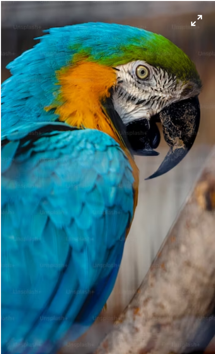
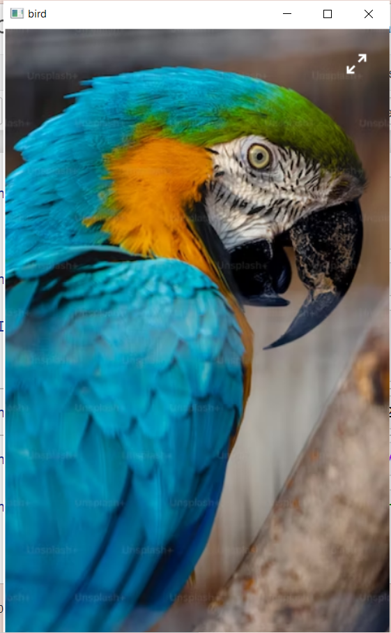
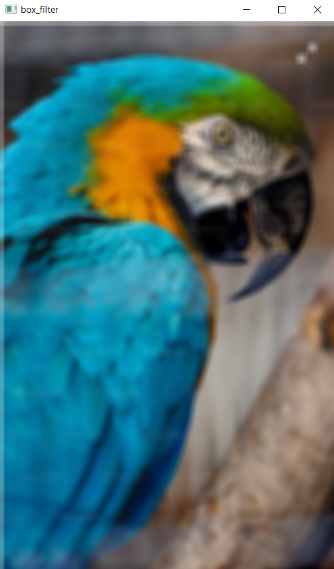
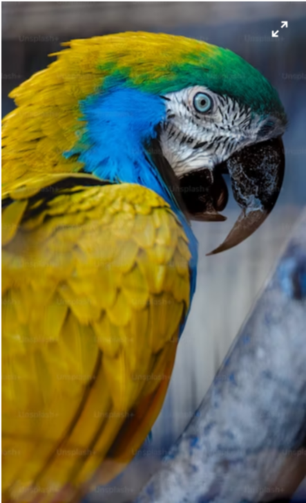
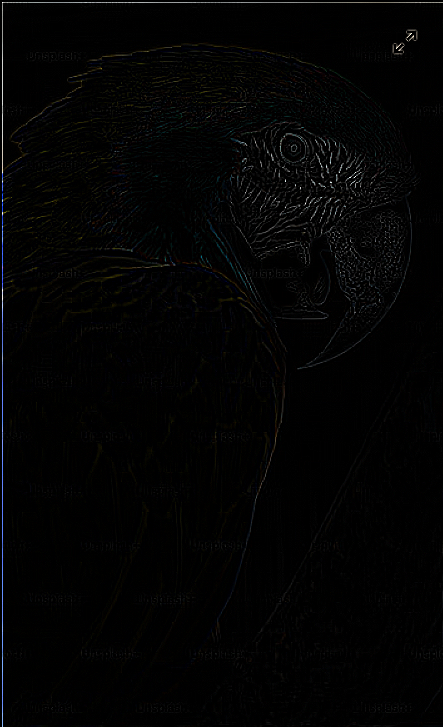

# Implementation-of-Filters
## Aim:
To implement filters for smoothing and sharpening the images in the spatial domain.

## Software Required:
Anaconda - Python 3.7

## Algorithm:
### Step1
Read and show the image

### Step2
Apply the filtering technique of smoothing
### Step3


### Step4
Apply filtering technique os sharpening

### Step5
Show the filtered image

## Program:
### Developed By   : Meiyarasi.V
### Register Number:212221230058
### 1. Smoothing Filters

i) Using Averaging Filter
```Python
import cv2
import numpy as np
import matplotlib.pyplot as plt
I= cv2.imread('mine.png',1)
cv2.imshow('bird',I)
cv2.waitKey(0)
cv2.destroyAllWindows()
filter = np.ones((11,11),np.float32)/121
box_filter = cv2.filter2D(I,-1,filter)
cv2.imshow('box_filter',box_filter)
cv2.waitKey(0)
cv2.destroyAllWindows()


```
ii) Using Weighted Averaging Filter
```Python

import cv2
import numpy as np
image = cv2.imread("mine.png")
M= cv2.cvtColor(image,cv2.COLOR_BGR2RGB)
cv2.imshow('original',M)
cv2.waitKey(0)
cv2.destroyAllWindows()

filter2 = np.array([[1,2,1],[2,4,2],[1,2,1]])/16
weighted_filter = cv2.filter2D(M,-1,filter2)
cv2.imshow('weighted_filter',weighted_filter)
cv2.waitKey(0)
cv2.destroyAllWindows()


```
iii) Using Gaussian Filter
```Python
import cv2
import numpy as np
image = cv2.imread("mine.png")
N = cv2.cvtColor(image,cv2.COLOR_BGR2RGB)
cv2.imshow('original',N)
cv2.waitKey(0)
cv2.destroyAllWindows()

gaussian_blur = cv2.GaussianBlur(src = N, ksize = (11,11), sigmaX=0, sigmaY=0) 
cv2.imshow('gaussian_filter',gaussian_blur)
cv2.waitKey(0)
cv2.destroyAllWindows()


```

iv) Using Median Filter
```Python


import cv2
import numpy as np
image = cv2.imread("mine.png")
G = cv2.cvtColor(image,cv2.COLOR_BGR2RGB)
cv2.imshow('original',G)
cv2.waitKey(0)
cv2.destroyAllWindows()
median = cv2.medianBlur(src=G,ksize = 11)
cv2.imshow('median_filter',median)
cv2.waitKey(0)
cv2.destroyAllWindows()


```

### 2. Sharpening Filters
i) Using Laplacian Kernal
```Python
import cv2
import numpy as np
image = cv2.imread("mine.png")
L = cv2.cvtColor(image,cv2.COLOR_BGR2RGB)
cv2.imshow('original',L)
cv2.waitKey(0)
cv2.destroyAllWindows()
kernel = np.array([[0,1,0],[1,-4,1],[0,1,0]]) 
laplacian_kernel = cv2.filter2D(L,-1,kernel)
cv2.imshow('laplacian_kernel',laplacian_kernel)
cv2.waitKey(0)
cv2.destroyAllWindows()
```
ii) Using Laplacian Operator
```Python
import cv2
import numpy as np
image = cv2.imread("mine.png")
O= cv2.cvtColor(image,cv2.COLOR_BGR2RGB)
cv2.imshow('original',O)
cv2.waitKey(0)
cv2.destroyAllWindows()
laplacian_operator = cv2.Laplacian(O,cv2.CV_64F)
cv2.imshow('laplacian_operator',laplacian_operator)
cv2.waitKey(0)
cv2.destroyAllWindows()
```

## OUTPUT:
### 1. Smoothing Filters
</br>

i) Using Averaging Filter




ii) Using Weighted Averaging Filter



iii) Using Gaussian Filter



iv) Using Median Filter


### 2. Sharpening Filters

i) Using Laplacian Kernal


ii) Using Laplacian Operator



## Result:
Thus the filters are designed for smoothing and sharpening the images in the spatial domain.
